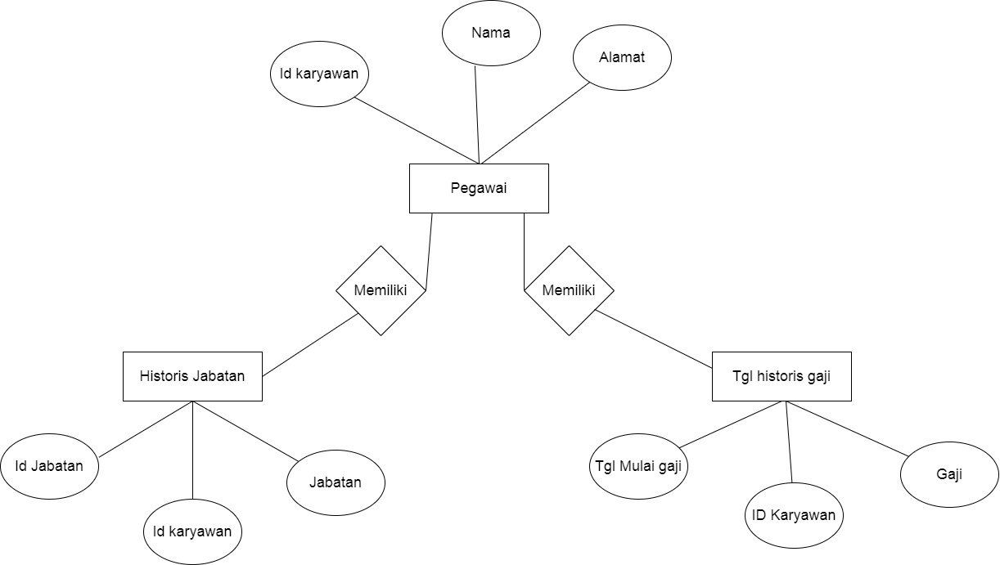

# contoh pemanfaatan data histori
- Hasil panen para petani per tahun atau per enam bulan 
- gaji karyawan 
- pemasukan keuangan negara 
- pengeluaran keuangan negara  
- kasus aktif covid 
- kasus kematian karena covid 
- trafik pengunjung mal per hari

# rancangan erd karyawan 
  
# rancangan table 

# sql 

```sql
CREATE TABLE karyawan(
  	id_Karywan int,
  	Nama VARCHAR(255),
  	Alamat VARCHAR(255)
  );
  
  CREATE TABLE tgl historis gaji(
    	tgl_mulai_gaji DATE,
    	id_Karyawan int,
    	Gaji INT
    );
  
  CREATE TABLE historis jabatan(
    	id_Jabatan int,
    	id_Karyawan int,
    	Jabatan VARCHAR(255)
    );
```
